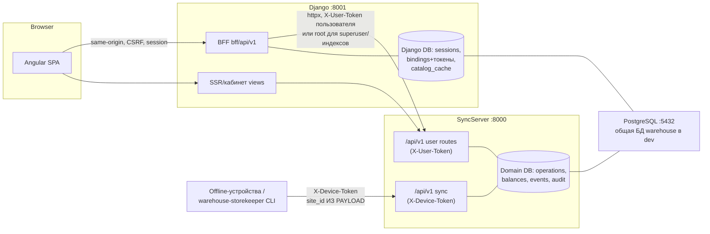

# Architecture & Security Audit — Warehouse Solution

- **Дата:** 2026-08-10
- **Режим:** read-only аудит. Код не изменялся, миграции не создавались, эксплуатация против живых систем не проводилась.
- **Метод:** 4 параллельные разведки (architecture recon, auth/security, data integrity/concurrency, ops/deployment) → точечная верификация критических находок главным аудитором по исходному коду → cross-check с `Functional and WorkLogik.md`, ADR и тестами (активный поиск опровержений).
- **Статусы:** `CONFIRMED` — проверено главным аудитором по коду; `REPORTED` — evidence разведки с file:line, точечно не перепроверено; `HYPOTHESIS` — логически вероятно, но не доказано.
- **Границы аудита:** SyncServer, Warehouse_web, Warehouse_frontend, Warehouse_client_core (частично), docker/compose/CI, документация. НЕ исследовались: WarehouseAIWorkstation (paused), WarehouseDesktop/WarehouseMobile, содержимое `.env` (не читалось по правилам безопасности), поведение VPS-prod (вне доступа).

---

## 1. Executive Summary

Система демонстрирует **выше среднего дисциплину доменного ядра**: UnitOfWork соблюдается на всех write-путях, идемпотентность операций реализована на двух уровнях (сервис + partial unique index), балансы — derived read model с пессимистичными блокировками и правильным lock ordering, аудит-журнал (audit_events + audit_item_effects) покрывает жизненный цикл операций. Это не «наивный» кодбейс.

Однако аудит выявил три класса системных проблем:

1. **Секреты и trust boundaries не соответствуют заявленной архитектуре.** Root-токен SyncServer и пароли БД закоммичены в git (`.env` tracked), токены пользователей/устройств хранятся plaintext без expiry, sync-контур доверяет `site_id` из payload устройства, а не привязке устройства к складу.
2. **Deployment-конфигурация — dev-grade.** `--reload` запечён в prod-образ SyncServer, `DJANGO_ENV` по умолчанию выбирает development-настройки (DEBUG=True, ALLOWED_HOSTS=*), миграции не автоматизированы, CI не запускает backend-тесты.
3. **Документация/ADR дрейфуют от кода** в обе стороны: часть «долга» уже реализована (ADR-0028), часть требований ADR не реализована и молчаливо отменена практикой (ADR-0005 read scope vs Functional doc «смотреть всё»).

**Наиболее серьёзный security risk:** `SEC-01` — `.env` с `SYNC_ROOT_USER_TOKEN`, `SECRET_KEY` и паролями БД в git-истории корневого репозитория в сочетании с plaintext токенами в БД. Любой с доступом к репо или БД получает полную имперсонацию вплоть до root. Ротация обязательна независимо от других мер.

**Наиболее серьёзный architecture risk:** отсутствие серверного outbox и доверие `site_id` из payload в sync-контуре (`ARC-04`, `SEC-03`). При появлении нескольких офлайн-клиентов и AI-агентов event-поток становится каналом cross-site чтения и инъекции, а частичные сбои доставки не имеют серверной точки восстановления.

**Наиболее серьёзный data-integrity risk:** `INT-01` — гонка двойной отмены submitted-операций с типами EXPENSE/WRITE_OFF: инверсные дельты применяются до блокировки строки операции, повторная отмена молча no-op'ится в repo, баланс завышается дважды. Тестами покрыт только RECEIVE.

---

## 2. System Architecture Map

### Компоненты и ownership данных

| Компонент | Роль | Ownership данных |
|---|---|---|
| **SyncServer** (FastAPI, :8000, `/api/v1`) | Единственный source of truth домена | 24 SQLAlchemy-модели: operations, balances, audit_events/audit_item_effects, events (sync journal), catalog (items/units/categories/issue_objects), users/devices/scopes, documents, temporary_items, machines. 28 сервисов, 21 repo, UoW (`app/services/uow.py`) |
| **Warehouse_web** (Django, :8001) | Web-клиент, host для Angular, BFF | Техническое состояние: sessions, `SyncUserBinding`/`SyncDeviceBinding` (**токены SyncServer в Django БД**), `catalog_cache_item` (кэш-снапшот), `RenderedDocumentArtifact` (PDF-кэш), legacy-зеркало `Site`, `UserProfile`, `LoginAttempt`. Домен не пишет — только через `apps/sync_client/` (httpx) |
| **Warehouse_frontend** (Angular) | SPA в content-area Django | Нет собственных данных; ходит только same-origin `/bff/api/v1` и `/nomenclature/api` (CONFIRMED: SyncServer-токенов в браузере нет) |
| **PostgreSQL 15** | Единая БД в dev-стенде | **Одна физическая БД `warehouse`** у SyncServer и Django (docker-compose.yml:34,64-69) — два контура миграций (Alembic + Django migrate); в prod по DEPLOYMENT.md:277-278 — отдельные БД |
| **Warehouse_client_core** (Rust) | Offline-first runtime (будущие клиенты) | SQLite + клиентский outbox, конфликты — пользовательские |
| **QuartermasterDocumentEngine**, **warehouse-storekeeper** | Untracked соседи: PDF-рендерер и CLI-skill | Вне git, вне CI |

### Взаимодействия и trust boundaries

**Trust boundaries:**
1. Браузер → Django: session + CSRF; SyncServer-токены в браузер не выдаются (CONFIRMED).
2. Django → SyncServer: внутренний HTTP с токеном пользователя (binding) или root-токеном (superuser + служебные индексы).
3. Устройство → SyncServer `/sync`: X-Device-Token; **граница сайта не проверяется** (SEC-03).
4. Оба бэкенда → одна физическая БД в dev (нарушение изоляции из ADR-0011, см. ARC-01).

**Жизненный цикл операции:** draft (create, идемпотентно по client_request_id) → submit (lock → state/version guards → materialize → snapshot → агрегированный balance pre-check → дельты под row-lock → revision 0 → документ (best-effort) → audit + effects → commit) → acceptance/lost/issued регистры → correction (root) / cancel (root для submitted) → restore (root).

---

## 3. Threat Model

### Assets
- Балансы и регистры (pending/lost/issued) — финансовая целостность склада.
- Аудит-журнал (audit_events, audit_item_effects) — доказательная база изменений.
- Токены пользователей/устройств и root-токен — ключи имперсонации.
- Event-журнал синхронизации (events) — источник истины для офлайн-клиентов.
- Django sessions/secret key — целостность веб-аутентификации.

### Actors
Обычный пользователь (storekeeper со scope), observer, chief_storekeeper (глобальный по дизайну), root, device token (офлайн-клиент), AI/agent-роль (ADR-0030), скомпрометированный клиент, злонамеренный внутренний сервис, повторный/дублирующий запрос, stale-клиент, сетевой сбой между Django и SyncServer.

### Entry points
- `/api/v1/*` (X-User-Token), `/api/v1/sync/*` (X-Device-Token), `/api/docs` (без auth — инфо-дискложур поверхности).
- Django `/bff/api/v1/*`, `/nomenclature/api`, `/admin/`, `/healthz/*`, `diagnostics_batch_view` (csrf_exempt, анонимный).
- PostgreSQL :5432 (наружу в dev compose).

### Privileged operations
Submit/cancel/restore операций (cancel/restore submitted — только root), corrections (root), admin users/devices/scopes + rotate-token (root), catalog admin (chief/root), модерация temporary/review items (chief/root, глобально).

### Critical invariants
1. Баланс = сумма эффектов; каждое изменение баланса сопровождается audit_item_effect (ADR-0028).
2. Submit идемпотентен по client_request_id; повтор не создаёт дубль.
3. Отмена операции применяет инверсные дельты **ровно один раз**.
4. Устройство сайта N не читает/не пишет event-поток сайта M.
5. Токен = личность; отзыв токена/пользователя немедленно прекращает доступ.

---

## 4. Critical / High Findings

### SEC-01 — Секреты (root-токен, пароли БД, SECRET_KEY) в git-истории
- **Severity:** Critical | **Confidence:** CONFIRMED | **Category:** Secrets
- **Affected:** корневой репо, SyncServer, Django, PostgreSQL
- **Evidence:** `git ls-files` → `.env` tracked; `git log -- .env` → коммиты `7bd1c21` («chore: setup dev environment — Makefile, docker-compose, .env, quickstart.sh»), `08fab68`. `.gitignore` `.env` не исключает. Дополнительно: дефолтные креды в `docker-compose.yml:13,34,56-57,128-137`; `setup_ubuntu.sh:188,191` (`sync_user`/`sync_password`); `start_opencode_web.sh:8` (пароль opencode).
- **Сценарий:** любой с read-доступом к репо (включая futuro-сотрудников, CI-логи, бэкапы репо) извлекает `SYNC_ROOT_USER_TOKEN` → полный root в SyncServer (создание пользователей, scopes, rotate-token). Доступ к БД (порт 5432 открыт в dev compose, пароль `warehouse_pass` по умолчанию) даёт plaintext токены всех пользователей.
- **Impact:** полная компрометация домена и имперсонация любой роли.
- **Почему защиты не работают:** защита построена на предположении, что секреты живут только в env; git-история — перманентный канал утечки; токены не хэшируются и не имеют expiry (SEC-04).
- **Remediation direction:** немедленная ротация всех токенов/паролей; `.env` → untracked + `.gitignore`; решение по очистке истории (filter-repo) с пониманием, что утечка уже могла произойти; секреты — только через secret manager/env injection.

### INT-01 — Гонка двойной отмены: двойное завышение баланса (EXPENSE/WRITE_OFF)
- **Severity:** High (data integrity) | **Confidence:** CONFIRMED | **Category:** Race condition
- **Affected:** `SyncServer/app/services/operations_service.py:2870-3145`, `app/repos/operations_repo.py:263-276`
- **Evidence (полная цепочка):**
  1. `cancel_operation` загружает операцию **без FOR UPDATE** (`get_operation_by_id`, :2876) и проверяет статус на незаблокированной строке (:2878).
  2. Инверсные дельты применяются **до** смены статуса (:2885-3100 → `uow.operations.cancel_operation` :3102).
  3. `repo.cancel_operation` (:263-276) берёт lock, но при уже-`cancelled` статусе **молча возвращает операцию без исключения**.
  4. `_apply_balance_delta` проверяет sufficiency только для отрицательных дельт (:626-636); положительные (rollback EXPENSE/WRITE_OFF `+qty`, :2952-2962; WRITE_OFF c issue_object `+qty` в issued-регистр, :2943-2951) проходят без контроля.
  5. Две одновременные отмены: обе проходят статус-гард, обе применяют `+qty` (сериализация на lock'е баланса не мешает — обе дельты положительные), вторая на `repo.cancel_operation` молча no-op'ится и коммитит дельту. Итог: баланс/issued-регистр завышен дважды, статус один, два `operation.cancel` аудит-события.
- **Защищённые ветки (проверено):** RECEIVE (`-accepted` → sufficiency), ADJUSTMENT rollback (`-quantity`), ISSUE (`_upsert_issued(-qty)` → ValueError→409 до `+qty` в сток), ISSUE_RETURN (порядок: сначала отрицательная дельта), MOVE без приёмки (явный `_ensure_sufficient_balance` :3025), MOVE с приёмкой (отрицательные дельты раньше положительных + `_upsert_pending` ValueError на отрицательный остаток).
- **Сценарий:** два одновременных root-запроса отмены (double-click, retry таймаута, два админа) на submitted EXPENSE → тихое завышение баланса без ошибки у обоих клиентов (оба получают 200).
- **Impact:** молчаливая порча балансов/issued-регистров; обнаруживается только сверкой (integrity_check.py существует, но постфактум).
- **Почему защиты не работают:** `test_cancel_concurrency.py:284-336` покрывает только RECEIVE; cancel submitted доступен только root (снижает вероятность, не отменяет); PHASE 0 pre-check (:2888) — read-only без lock, обе транзакции его проходят.
- **Remediation direction:** сначала `get_operation_by_id_for_update` + статус-переход (или conditional UPDATE `WHERE status='submitted'` с проверкой rowcount), затем инверсные дельты; либо идемпотентный ключ отмены. Тесты на EXPENSE/WRITE_OFF/ISSUE/MOVE-acceptance concurrency.

### SEC-03 — Sync pull/push: site_id берётся из payload, а не из привязки устройства
- **Severity:** High | **Confidence:** CONFIRMED | **Category:** Trust boundary / AUTHZ
- **Affected:** `SyncServer/app/api/routes_sync.py:56,103-104,163-164`, `app/services/sync_service.py:49-52`, `app/models/device.py:22-26`
- **Evidence:** `Device.site_id` существует (устройство приписано к складу), `Identity.device_site_id` существует (`app/core/identity.py:81-82`), но в `/pull` (`uow.events.pull(site_id=payload.site_id)`) и `/push` (`process_push(request=payload)`) сайт берётся из тела запроса; сравнения с `identity.device_site_id` нет.
- **Сценарий:** устройство сайта A (или скомпрометированный/украденный device token) выполняет `/pull` с `site_id=B` → читает event-поток сайта B (операции, движения ТМЦ); `/push` с `site_id=B` → инъекция событий в журнал B (события — лог, не прямая мутация балансов, но офлайн-клиенты B потребляют их как источник истины).
- **Impact:** cross-site утечка операционных данных; отравление event-потока чужого сайта.
- **Почему защиты не работают:** rate limit ключуется по device_id, а не по сайту; dedup по event_uuid не мешает чтению и валидным новым uuid.
- **Remediation direction:** `payload.site_id` обязан совпадать с `identity.device_site_id` (403 при расхождении), либо явный ADR, разрешающий мульти-сайт устройствам.

### SEC-04 — Токены plaintext UUID в БД, без expiry/revocation-метаданных
- **Severity:** High | **Confidence:** CONFIRMED | **Category:** Token lifecycle
- **Affected:** `SyncServer/app/models/user.py:23-28`, `app/models/device.py:16-21`
- **Evidence:** `user_token`/`device_token` — `Mapped[UUID] unique default=uuid4`, колонок `expires_at`/`revoked_at`/`token_version` нет; отзыв только `is_active=false` + ручная ротация root'ом (`routes_admin_users.py:148-162`).
- **Сценарий:** чтение БД (открытый порт 5432, общая БД, бэкапы в `backups/` включая `prod_backup_*.sql.gz`) или дампа → мгновенная имперсонация всех пользователей без подбора.
- **Impact:** токен = вечный bearer-ключ; компрометация не имеет временного горизонта самозатухания.
- **Remediation direction:** хэш токенов в БД (показывать полный токен только при создании/ротации), expiry + скользящая ротация, token_version для мгновенного отзыва сессий.

### SEC-06 — Django superuser = SyncServer root; дефолтный admin/admin123; dev-режим по умолчанию
- **Severity:** High | **Confidence:** REPORTED (file:line от разведки) | **Category:** Privilege coupling
- **Affected:** `Warehouse_web/apps/sync_client/token_resolver.py:74-75`, `apps/bff_api/helpers.py:199-200`, Django admin
- **Evidence:** `resolve_sync_identity` выдаёт root-токен для `is_superuser`; дефолтный superuser `admin/admin123` (AGENTS.md, TZ-AGENT_ROLE_ADMIN_UI.md:366, E2E-креды docker-compose.yml:128-137); при `DJANGO_ENV` ≠ production активен development-профиль (OPS-02) с DEBUG=True и runserver (трейсбеки наружу).
- **Сценарий:** компрометация Django-сессии суперюзера (дефолтный пароль, CSRF-цепочка, DEBUG-трейсбек) = root в SyncServer без какой-либо проверки на стороне SyncServer.
- **Impact:** эскалация до полного контроля домена.
- **Remediation direction:** разделение «Django superuser» и «SyncServer root» (отдельная привязка с явным назначением), запрет дефолтных кредов в prod, hardening admin-входа.

### OPS-01 — Prod-образ SyncServer запускается с `--reload`, 1 worker
- **Severity:** High | **Confidence:** CONFIRMED | **Category:** Deployment
- **Affected:** `SyncServer/Dockerfile` (CMD `uvicorn main:app --host 0.0.0.0 --port 8000 --reload`), `SyncServer/docker-compose.yml` (нет `command:` → наследует CMD)
- **Сценарий:** prod-деплой по DEPLOYMENT.md поднимает SyncServer с file-watcher'ом, одним процессом, без timeout-контроля: деградация latency, перезагрузки при изменении файлов, небезопасный режим reload.
- **Remediation direction:** prod command с `--workers N --timeout T` без `--reload`; dev-флаги только в dev compose.

### OPS-02 — `DJANGO_ENV` по умолчанию выбирает development-профиль
- **Severity:** High | **Confidence:** CONFIRMED (код) / HYPOTHESIS (состояние VPS) | **Category:** Configuration
- **Affected:** `Warehouse_web/config/settings/__init__.py:3-9`, `config/settings/development.py:5-7`
- **Evidence:** `_environment = os.getenv("DJANGO_ENV", "development")`; development → `DEBUG=True`, `ALLOWED_HOSTS=os.getenv("DJANGO_ALLOWED_HOSTS","*")`. Список VPS env-переменных в DEPLOYMENT.md не содержит `DJANGO_ENV`.
- **Сценарий:** на VPS без явного `DJANGO_ENV=production` приложение работает с DEBUG=True (утечка настроек/трейсбеков) и произвольным Host.
- **Remediation direction:** инвертировать дефолт (production, если не доказано иное) или fail-fast при отсутствии `DJANGO_ENV` в не-dev окружении; проверить VPS.

### OPS-03 — CI не запускает backend-тесты
- **Severity:** High (quality gate) | **Confidence:** CONFIRMED | **Category:** Testing/CI
- **Affected:** `.github/workflows/` — только `e2e-tests.yml` и `frontend-unit-tests.yml`
- **Evidence:** нет workflow для `python -m pytest` (SyncServer, 100+ тест-файлов) и `python manage.py test` (Warehouse_web, 27 тест-файлов); e2e-воркфлоу создаёт `.env` с дефолтными паролями и DEBUG=True.
- **Impact:** регрессии уровня INT-01/SEC-03 могут попасть в `dev`/`main` незамеченными; локальный прогон тестов — добровольная практика.
- **Remediation direction:** обязательные pytest + manage.py test + alembic-проверка в CI на каждый PR.

### SEC-09 — Production-настройки без HTTPS-hardening
- **Severity:** High (для prod) | **Confidence:** REPORTED | **Category:** Transport security
- **Affected:** `Warehouse_web/config/settings/production.py:8-22`
- **Evidence:** `SESSION_COOKIE_SECURE=False`, `CSRF_COOKIE_SECURE=False`, HSTS=0, `SECURE_SSL_REDIRECT=False` (комментарий «Пока нет HTTPS»); `SECURE_PROXY_SSL_HEADER`/`USE_X_FORWARDED_HOST=True` без allowlist доверенных прокси.
- **Impact:** сессии/CSRF-куки перехватываемы при появлении HTTP-доступа; подмена Host/X-Forwarded-Proto тривиальна без прокси-allowlist.
- **Remediation direction:** включить cookie secure/HSTS одновременно с вводом HTTPS; зафиксировать allowlist прокси.

---

## 5. Medium Findings

(Включая один Low — SEC-10, сгруппирован здесь по теме input validation.)

### INT-02 — Submit проглатывает сбой генерации документа; коррекция — атомарна
- **Severity:** Medium | **Confidence:** CONFIRMED | **Category:** Partial failure
- **Evidence:** `operations_service.py:2342-2379` — генерация документа после смены статуса в `try/except Exception → logger.warning` («Логируем ошибку, но не прерываем выполнение»); операция submitted, пользователь получает 200 с `document_created=None`. Аналогично `insert_resource` audit-ссылок (:2405-2423). При этом в `corrections_service.submit_correction:574-629` генерация документа НЕ обёрнута — сбой откатывает коррекцию.
- **Сценарий:** системный сбой рендера (WeasyPrint, шаблон) → серия операций без документов; обнаружимо только по `document_created=None` или логам.
- **Remediation direction:** единый контракт: либо атомарный rollback, либо очередь отложенной регенерации с признаком «документ не создан» в ответе и статусе операции.

### INT-03 — Concurrent create с одним client_request_id → 500 вместо 409
- **Severity:** Medium | **Confidence:** CONFIRMED (исключением: обработчики IntegrityError только в :1898 (SKU) и :2445 (submit)) | **Category:** Error contract
- **Evidence:** `routes_operations.py:151-172` + `operations_service.create_operation` (:1088, dedup-lookup :1097-1120): при гонке двух POST оба проходят lookup, один падает на commit с IntegrityError по partial unique index `ix_operations_client_request_id` → необработанный 500. Данные не дублируются (индекс защищает), но клиент получает 500 и не понимает, что операция создана у конкурента.
- **Remediation direction:** catch IntegrityError → повторный lookup → 200/409 по аналогии с submit.

### INT-04 — Approve/merge временных ТМЦ и review-confirm без блокировки
- **Severity:** Medium | **Confidence:** REPORTED | **Category:** Race condition
- **Evidence:** `temporary_items_resolution_service.py:162-169` — `get_by_id` без FOR UPDATE + статус-проверка, read-modify-write без conditional UPDATE; `review_items_service.py:44-58,148-157` — тот же паттерн; `catalog_admin_service.merge_items:666-703` — source/target без lock.
- **Сценарий:** два параллельных approve одного temporary item → два permanent Item (балансовая часть спасена lock'ами, при нулевом остатке дубли проходят).
- **Remediation direction:** FOR UPDATE или conditional UPDATE `WHERE status='active'` с проверкой rowcount.

### INT-05 — catalog_cache: нет TTL, write-through best-effort, внешние мутации не инвалидируют
- **Severity:** Medium | **Confidence:** REPORTED | **Category:** Stale cache
- **Evidence:** `apps/catalog_cache/models.py` (CatalogCacheItem без TTL), `write_through.py:35-49` (ошибки глотаются), sync только ручной (`catalog/views.py:400-407`, management command); мутации SyncServer мимо Django admin (inline-ТМЦ при submit, approve, batch, другие клиенты) не инвалидируют кэш.
- **Сценарий:** пользователь видит в поиске неактуальные/удалённые ТМЦ до следующего ручного sync; UI-потоки опираются на кэш при выборе ТМЦ в операцию.
- **Remediation direction:** TTL/версионирование снапшота, инвалидация по событиям SyncServer, явный признак staleness в API.

### INT-08 — Таймаут записи BFF → 504 `operation_outcome_unknown`, Angular не обрабатывает авто-повтор
- **Severity:** Medium | **Confidence:** REPORTED | **Category:** Partial failure / UX
- **Evidence:** `bff_api/operations_views.py:123-139` (504 + `retry_safe:true`), `transport.py:48-58` (ретраи только GET/HEAD/OPTIONS); в `Warehouse_frontend/src/app` grep `retry_safe|operation_outcome_unknown` пуст.
- **Сценарий:** таймаут при submit → пользователь видит 504, повторяет вручную; повтор безопасен благодаря client_request_id, но контракт `retry_safe` не используется клиентом — потенциальный дубль-страх и ложные «операция не прошла».
- **Remediation direction:** обработка `operation_outcome_unknown` в SPA (опрос статуса по идемпотентному ключу / авто-повтор).

### SEC-07 — Acting user context: параметры приняты, но не отправляются
- **Severity:** Medium | **Confidence:** CONFIRMED | **Category:** Audit attribution / dead contract
- **Evidence:** `Warehouse_web/apps/sync_client/client.py:65-92` — `build_headers(acting_user_id=..., acting_site_id=...)` принимает параметры и **игнорирует** их; заголовка `X-Acting-User` нет. SyncServer пишет в аудит того, чей токен в `X-User-Token`.
- **Impact:** для потоков, где Django ходит root-токеном (индексы сайтов, кэш), актор в аудите — root, реальный инициатор потерян; API создаёт ложное впечатление поддержки acting context.
- **Remediation direction:** либо реализовать заголовок + проверку на SyncServer, либо удалить параметры из сигнатур.

### SEC-08 — Plaintext пароль транзитом в SyncServer при каждом Django-логине
- **Severity:** Medium | **Confidence:** CONFIRMED | **Category:** Secrets in transit
- **Evidence:** `apps/users/sync_signals.py:60-67` — `password = request.POST.get('password')` → `sync_auth_login` → `auth_integration.py:133-136` POST `/auth/sync-user` с force_root. SyncServer-схема `UserCreate` поля `password` не имеет — pydantic игнорирует, пароль не сохраняется, но проходит по внутреннему HTTP и доступен в точках логирования тела запроса.
- **Remediation direction:** заменить на проверку binding'а/существующего токена; пароль не должен покидать Django.

### OPS-04 — Миграции не автоматизированы
- **Severity:** Medium | **Confidence:** REPORTED | **Category:** Deployment
- **Evidence:** `Warehouse_web/entrypoint.sh` (migrate + collectstatic) существует, но не подключён (Dockerfile без ENTRYPOINT, compose задаёт `command` напрямую); SyncServer: `main.py:42-47` startup-миграции — no-op, prod `migrate`-сервис в profile `tools` запускается вручную; dev — `make migrate`.
- **Сценарий:** деплой без ручного шага → приложение стартует на немигрированной схеме.
- **Remediation direction:** entrypoint в образе или явный one-shot migrate-шаг в деплой-пайплайне.

### OPS-05 — Дефолтные креды, открытые порты, контейнеры от root
- **Severity:** Medium | **Confidence:** REPORTED | **Category:** Deployment hygiene
- **Evidence:** `docker-compose.yml:13,34,56-57,128-137` (warehouse_pass, SECRET_KEY-дефолт, DEBUG=True, E2E admin123/089786); postgres `5432:5432` наружу (:15); `USER` в Dockerfile нет; syncserver без healthcheck, `depends_on: service_started` (:77-81).
- **Remediation direction:** порты только в internal-сеть, креды из secret-источника, non-root USER, healthcheck syncserver.

### OPS-06 — LocMemCache при нескольких workers gunicorn
- **Severity:** Medium | **Confidence:** REPORTED | **Category:** Scaling
- **Evidence:** `config/settings/base.py:157-163` — LocMemCache; prod Django — gunicorn `--workers 3` → кэш/рате-лимиты (в т.ч. `diag_ratelimit` в diagnostics_views) разъезжаются между процессами.
- **Remediation direction:** Redis/memcached для prod.

### OPS-08 — DEPLOYMENT.md содержит нерабочие команды
- **Severity:** Medium | **Confidence:** REPORTED | **Category:** Doc drift / operability
- **Evidence:** `docs/DEPLOYMENT.md:159` — `docker compose exec web ... migrate`, но контейнер называется `warehouse_web` (`Warehouse_web/docker-compose.yml:3`) → команда падает в момент деплоя.
- **Remediation direction:** синхронизировать имена; прогнать runbook всухую.

### ARC-01 — Общая физическая БД у Django и SyncServer в dev-стенде
- **Severity:** Medium | **Confidence:** CONFIRMED | **Category:** Isolation / ADR drift
- **Evidence:** `docker-compose.yml:34` (SyncServer → `warehouse`) и `:64-69` (Django → та же `warehouse`); ADR-0011 отвергает прямой доступ Django к БД SyncServer; prod по DEPLOYMENT.md:277-278 — отдельные БД. ORM-доступа Django к таблицам SyncServer нет (проверено), но два контура миграций в одной БД и класс «работает в dev, ломается в prod» остаются.
- **Remediation direction:** две БД в dev compose, как в prod.

### ARC-04 — Серверного outbox нет; доставка событий клиентам — best-effort pull
- **Severity:** Medium (time bomb) | **Confidence:** REPORTED | **Category:** Architecture
- **Evidence:** outbox реализован только на клиенте (Rust `outbox_service.rs:72-84`, state machine `storage/repos.rs:642-696`); в SyncServer таблицы outbox нет (grep пуст). Сервер лишь принимает push с dedup и отдаёт pull.
- **Сценарий обострения:** несколько офлайн-клиентов + AI-агенты: нет серверной точки повторной доставки, нет гарантии, что событие, зафиксированное в `events`, доставлено конкретному потребителю; частичный сбой push-батча решается только клиентским retry.
- **Remediation direction:** серверный outbox/подписки с курсорами доставки до расширения парка клиентов.

### SEC-10 — Ограниченный path traversal в выборе шаблона документа
- **Severity:** Low | **Confidence:** REPORTED | **Category:** Input validation
- **Evidence:** `SyncServer/app/services/document_renderer.py:117-131` — `template_name` из запроса подставляется в `templates_root / f"{normalized}.html"`; ограничен суффиксом `.html` и `exists()`.
- **Remediation direction:** allowlist имён шаблонов.

---

## 6. Architectural Debt

### ARC-02 — Два параллельных PDF-рендера при ADR-0029 в статусе Proposed
- **Проблема:** waybill рендерится и в SyncServer (`app/services/document_renderer.py`, Jinja2+WeasyPrint), и в Django (`apps/documents/services.py:433` + `RenderedDocumentArtifact`); рядом существует untracked `QuartermasterDocumentEngine/` (третий контур).
- **Почему появилась:** печатные формы нужны были быстрее, чем архитектурное решение; ADR-0029 зафиксировал границы, но не принял решение.
- **Обострение:** несколько клиентов (desktop/mobile/AI) получат разные печатные формы одного документа; шаблоны расходятся.
- **Сложность устранения:** средняя — требует ADR-решения о единственном рендерере и миграции шаблонов.

### ARC-03 — Legacy-зеркало Site в Django с dual-write
- **Проблема:** `apps/users/models.py:11-25` (`class Site` — «Legacy warehouse site mirror») + `SiteSyncService._upsert_local_mirror` (`apps/users/services.py:363-383`): запись в SyncServer и локально; `SiteAdmin` позволяет править зеркало руками.
- **Обострение:** рассинхрон при сбое второго шага; ручная правка зеркала создаёт тихий drift.
- **Сложность:** низкая-средняя (зеркало используется для отображения; заменяется read-through в SyncServer).

### ARC-05 — Дрейф документации и ADR (систематический)
- **Проблема:** ENDPOINT_INVENTORY.md документирует удалённые `/recipients/*` (в `__pycache__` остались osиротевшие .pyc); SyncServer/AGENTS.md:20 упоминает несуществующие `/business/*`; `django_routes.txt` не совпадает с фактическими urls; счётчики ADR-0002/0003 устарели; ADR-0028 «implementation pending», хотя Stage A почти реализован.
- **Обострение:** новые агенты/разработчики принимают решения по устаревшим ADR (см. SEC-02 ниже — едва не привело к ложной находке).
- **Сложность:** низкая, но требует дисциплины «ADR обновляется вместе с кодом».

### ARC-06 — Мёртвая конфигурация FRONTEND_MODE
- **Проблема:** `FRONTEND_MODE=dev`/`FRONTEND_DEV_SERVER_URL` объявлены (settings, docker-compose.yml:72), но не читаются; `_AngularSpaServeMixin` всегда отдаёт `FRONTEND_BUILD_DIR`; в `angular.json` нет proxyConfig. Заявленный dev-режим не существует.
- **Обострение:** молчаливое расхождение конфигурации и поведения при онбординге.

### ARC-07 — God-service и смешение слоёв (точечно)
- **Проблема:** `operations_service.py` — 3336 строк, несёт submit/cancel/restore/acceptance/lost/effects/balance-хелперы; в routes встречаются явные `uow.commit()` (`routes_documents.py:96,278,356`, `routes_diagnostics.py:135-137`) — no-op из-за guard UoW, но нарушение единого паттерна.
- **Обострение:** цена каждого изменения в lifecycle операций растёт; риск регрессий уровня INT-01.

### ARC-08 — Shadow-компоненты вне git и CI
- **Проблема:** `QuartermasterDocumentEngine/` и `warehouse-storekeeper/` — untracked, без CI, с собственными .venv (~0.5 ГБ каждый); при этом storekeeper-CLI ходит в SyncServer напрямую.
- **Обострение:** невоспроизводимость, потерь версий, неконтролируемый клиент домена.

### ARC-09 — Root-токен в пользовательских BFF-потоках
- **Проблема:** `bff_api/operations_enricher.py:51` делает `force_root=True` на каждый BFF-запрос операций ради индекса сайтов (также `operations/views.py:543,574,751,937`, `balances/views.py:27`, `catalog_cache/services.py:52`). Смягчение: возвращаются только имена сайтов.
- **Обострение:** рост поверхности root-токена во внутреннем трафике; аудит таких запросов атрибутится root'у (см. SEC-07).
- **Remediation direction:** публичный read-only эндпоинт списка сайтов для ролей вместо root.

---

## 7. Data Integrity & Concurrency Risks

Сводка (детали в секциях 4-5):

| Риск | Механизм | Статус |
|---|---|---|
| **INT-01 двойная отмена** | дельты до lock'а + молчаливый no-op в repo | CONFIRMED, EXPENSE/WRITE_OFF |
| **INT-02 документ без операции-гарантии** | swallowed exception после смены статуса | CONFIRMED |
| **INT-03 500 вместо 409 при гонке create** | нет IntegrityError-обработчика в create-пути | CONFIRMED |
| **INT-04 дубли при approve/merge** | unlocked check-then-act | REPORTED |
| **INT-05 stale catalog_cache** | нет TTL/инвалидации от внешних мутаций | REPORTED |
| **INT-06 batch partial commit** | `apply_batch` коммитит частичный успех вопреки docstring «rolls back the entire batch» (`catalog_admin_service.py:1048-1192`, outcome='partial') | REPORTED |
| **INT-07 номера документов без unique** | `display_number` = ddMMyy/HHmm/site_id (`document_service.py:104-110`) → дубль при двух операциях в одну минуту | REPORTED |
| HYPOTHESIS: первая строка balance | окно между get_for_update=None и insert у двух транзакций → PK violation 500 | HYPOTHESIS (низкая вероятность) |

**Сильные стороны (подтверждено):** UoW-дисциплина на всех write-путях; идемпотентность submit/create на сервисном и DB-уровне (partial unique indexes, 409-контракт в submit); балансы lock-first с корректным lock ordering (`corrections_service.py:424-426`, агрегированный pre-check `sorted(keys)` :382-424); double-submit и double-accept защищены и покрыты тестами; `scripts/integrity_check.py` (READ ONLY транзакция, коды BALANCE_EFFECT_DRIFT) — есть инструмент пост-аудита.

**Ключевой системный вывод:** защита от гонок построена на sufficiency-проверках отрицательных дельт. Там, где откат даёт положительную дельту, защиты нет — это класс, а не единичный баг (INT-01).

---

## 8. Authentication / Authorization Review

### Фактическая модель доверия

1. **Идентификация:** единая точка `IdentityService.resolve_identity` (`app/api/deps.py:90-131`): `/sync` — `X-Device-Token`, остальное — `X-User-Token`. Root — обычный User с `is_root=True`, токен из env. Health-роуты публичны (приемлемо). Все business-роутеры имеют auth-депы (проверено по 23 файлам).
2. **Роли:** `root`, `chief_storekeeper`, `storekeeper`, `observer`, `agent` (CK users.role). `has_global_business_access = is_root or chief_storekeeper` (`core/identity.py:85-87`) — **chief глобален по дизайну**.
3. **Site scoping — асимметричный (по дизайну Functional doc):**
   - **Запись:** site-scoped честно — `require_operate_site` (`operations_policy.py:29-35`), `require_operation_submit_permission` (:100-141), документы `has_site_access` (`routes_documents.py:32-45`).
   - **Чтение:** глобально для всех READ_ROLES — `require_read_site` игнорирует site_id (:21-26), `resolve_readable_site_ids` возвращает все сайты (:250-288). Это **соответствует** `Functional and WorkLogik.md` §2.1.1-2.1.3 («Обозреватель… может смотреть всё», «Кладовщик… может просматривать всё»), но **противоречит букве ADR-0005** («Non-root access is site-scoped through UserAccessScope»). Примитивы scope (`Identity.get_accessible_site_ids`, `AccessService.can_view_site`) существуют, но read-путями не используются.
4. **Django-мост:** пользовательский токен из `SyncUserBinding` (session), superuser → root-токен (`token_resolver.py:74-75`); эскалация ограничена `is_superuser`. Acting user context не передаётся (SEC-07).
5. **Устройства:** device token + `device.site_id`, но sync-контур сайт не проверяет (SEC-03). `sync/status/{device_id}` проверяет владельца (OK).
6. **Объектная авторизация:** операции/документы проверяются по объекту; corrections/restore — root-only; draft-изменение — creator/chief/root; agent — только свои draft (ADR-0030, `require_agent_own_draft`).
7. **CSRF/CORS:** CsrfViewMiddleware включён; единственный `@csrf_exempt` — diagnostics batch (анонимный, проксирует `X-User-Token` из заголовка запроса; rate-limit обходится ротацией `X-Client-Session-Id` — Low). django-cors не установлен; Angular ходит same-origin с `X-CSRFToken` (OK). SyncServer CORSMiddleware не имеет (`ALLOWED_ORIGINS` — мёртвый конфиг), браузер в SyncServer напрямую не ходит (OK).
8. **Injection-поверхность:** SQL только через ORM (text() статический); pickle/yaml.load/eval/exec в runtime отсутствуют; SSRF-поверхности нет (фиксированный `SYNC_SERVER_URL` + префикс `/api/v1`); subprocess без shell=True в рендерере.

**Главный структурный дефект модели:** identity-примитивы (scopes, device_site_id, acting user) богаче, чем фактическое enforcement — несколько «мёртвых» параметров создают иллюзию контроля (SEC-03, SEC-07, dead site_id в require_read_site/require_temporary_item_moderation).

---

## 9. Deployment & Operational Risks

1. **OPS-01/OPS-02** (High): `--reload` в prod-образе; development-профиль по умолчанию. См. секцию 4.
2. **OPS-04** миграции не автоматизированы; **OPS-08** runbook содержит нерабочую команду `exec web`.
3. **Бэкапы:** только ручные (`Makefile backup-db`); в `backups/` лежит `prod_backup_20260708_115420.sql.gz` (prod-дамп в папке репо) и дамп с аномалией `\restrict <token>` (строка 5 — не валидный pg_dump-артефакт, происхождение неясно). Scheduled backup отсутствует.
4. **Observability:** structlog + request_id в обоих бэкендах, healthchecks SyncServer (`/api/v1/health`, `/ready`, liveness/readiness) и Django (`/healthz/`, `/healthz/sync/`). Метрик (prometheus) и Sentry нет; алертинга нет. В dev compose healthcheck только у postgres и warehouse_web.
5. **Зависимости:** SyncServer полный пин `==` (29 пакетов, pytest в main-requirements); Django — диапазоны с верхней границей без lockfile; Angular — caret + package-lock (`npm ci` в CI). Оба Dockerfile ставят pip с `mirrors.aliyun.com` (supply-chain/доступность).
6. **Мусор в корне:** `node_modules/` 348 МБ без package.json, `.tmp_font_test_dest`, битый файл-трассировка, скриншоты, `Makefile.bak` — гигиена репо.
7. **Миграции Alembic:** merge-миграция `8e9a044a0fcf` и дубль номера `0010_*` — следы параллельных веток; `env.py` compare_type/compare_server_default=True (шум autogenerate). Автозапуска нет (main.py no-op).

---

## 10. Test Coverage Gaps

1. **Cancel-concurrency покрыт только RECEIVE** (`tests/test_cancel_concurrency.py:284-336`) — EXPENSE/WRITE_OFF/ISSUE/MOVE-acceptance не покрыты (прямой путь к INT-01).
2. **CI не запускает backend-тесты вообще** (OPS-03) — 100+ тест-файлов SyncServer и 27 Warehouse_web существуют, но не являются гейтом.
3. **Read-scope политика не зафиксирована тестами:** `test_access_service_business_access.py` тестирует AccessService-примитивы, но поведение `OperationsPolicy.require_read_site`/`resolve_readable_site_ids` (глобальное чтение) тестом как контракт не закреплено — неясно, intentional оно или accidental.
4. **Angular:** нет обработки/тестов `operation_outcome_unknown` (INT-08).
5. **Untracked-компоненты** (QuartermasterDocumentEngine, warehouse-storekeeper) имеют локальные тесты, но вне CI и вне контроля версий.
6. **Скрипты верификации** (`verify_migration.py`, `verify_alembic.py`) и корневой tooling без тестов.
7. **Diagnostics batch:** rate-limit по контролируемому заголовку не покрыт тестом на обход.

---

## 11. Documentation / ADR / Implementation Drift

| Источник | Утверждает | Код/факт | Оценка |
|---|---|---|---|
| ADR-0005 | «Non-root access is site-scoped through UserAccessScope» | Запись site-scoped, чтение глобальное (по Functional doc §2.1) | Дрейф ADR vs Functional doc vs код; требует явного ADR-уточнения |
| ADR-0028 | Stage A «implementation pending» | Почти весь Stage A реализован (effective_at guard, restore-аудит, catalog soft-delete аудит, per-action effects, integrity_check CLI) | Статус ADR устарел в обратную сторону |
| ADR-0029 | Status: Proposed, backend не предрешён | Два рендера уже работают (SyncServer + Django), третий существует untracked | Решение перезрело |
| ADR-0002/0003 | 16 модулей sync_client / счётчики 22/16/16/18 | 24 модуля / 28/21/19/24; `recipients_api.py` нет | Evidence устарел |
| ENDPOINT_INVENTORY.md | `/recipients/*` существует | Удалён (остались .pyc); API_MAP.md говорит «replaced by IssueObject» | Внутреннее противоречие доков |
| SyncServer/AGENTS.md:20 | `/business/*` compatibility routes | Отсутствуют в коде | Док-vs-код |
| django_routes.txt | Роуты users/, sites/, categories/create/ | SSR ушёл под `/catalog/ssr/`, `/nomenclature/ssr/` | Устарел |
| DEPLOYMENT.md | `docker compose exec web migrate` | Контейнер `warehouse_web` | Команда нерабочая |
| `apply_batch` docstring | «Any failure rolls back the entire batch» | Частичный успех коммитится (outcome='partial') | Контракт docstring-vs-поведение |
| `User.default_site_id` comment | «does not restrict access» | Согласуется с read-поведением, но не с ADR-0005 | Маркер intentional-чтения |
| FRONTEND_MODE | dev-режим с proxy | Не реализован | Мёртвый конфиг |

---

## 12. Rejected Findings

Подозрения, которые были исследованы и **не подтвердились** — важно для отличия аудита от генератора страшных слов:

1. **Cross-site чтение операций/остатков/каталога как уязвимость (SEC-02).** Исследовано глубоко: `require_read_site` действительно игнорирует site_id, НО `Functional and WorkLogik.md` §2.1.1-2.1.3 прямо предписывает «смотреть всё/просматривать всё» для observer/storekeeper/chief при site-scoped только записи. Код соответствует каноническому функциональному документу. Остаток переведён в drift ADR-0005 (секция 11) и dead-parameter.
2. **Модерация временных ТМЦ чужого сайта scoped-chief'ом (SEC-05).** Опровергнуто: `has_global_business_access` включает chief_storekeeper, поэтому `require_temporary_item_moderation` (:220-232) пропускает root/chief до проверки site_id, а остальные роли не проходят вовсе. «Scoped chief» в системе не существует — chief глобален по дизайну (Functional §2.1.3). Параметр site_id — мёртвый код, не эскалация.
3. **SQL-инъекции.** Не найдено: все запросы через ORM, `text()` только статический, raw()/f-string SQL отсутствуют.
4. **SSRF.** Не найдено: исходящие вызовы Django только на фиксированный `SYNC_SERVER_URL` с обязательным префиксом `/api/v1`.
5. **Небезопасная десериализация (pickle/yaml.load/eval/exec).** Не найдена в runtime-коде всех трёх бэкендов.
6. **Логирование токенов.** Не подтвердилось: access-log пишет method/path/status, redaction применяется к телам ошибок. Найден только анти-паттерн в docstring (`auth_integration.py:24`) — не исполняется.
7. **Попадание SyncServer-токенов в браузер.** Не подтвердилось: Angular ходит только same-origin, токены в localStorage/sessionStorage — только черновики/диагностика.
8. **Локальная доменная запись Django мимо SyncServer.** Не подтвердилась: `apps/catalog/models.py` пуст, balances/temporary_items без models.py, все пишущие потоки через `sync_client`; миграция `0002_remove_local_catalog_models` фиксирует удаление.
9. **Прямые импорты SyncServer-кода из Django / DB-router хаки.** Не найдены.
10. **Двойной submit / двойной accept как гонки.** Опровергнуто кодом и тестами (FOR UPDATE + populate_existing, re-check remaining внутри lock'а).
11. **Двойная отмена доступна не-root пользователям.** Опровергнуто: cancel submitted — только root (`require_operation_cancel_permission` :179-182). Снижает likelihood INT-01, не отменяет его.
12. **Баланс можно увести в минус через submit.** Не подтвердилось: агрегированный pre-check под lock'ами в порядке `sorted(keys)` + sufficiency на каждой отрицательной дельте.
13. **`\restrict <token>` в SQL-дампе как инъекция в БД.** Не подтверждено как атака: артефакт в файле дампа, не валидный pg_dump; происхождение неясно, оставлено как операционный вопрос (секция 9), не как finding.

---

## 13. Top-10 Recommended Actions

| # | Приоритет | Действие | Impact | Effort | Dependencies |
|---|---|---|---|---|---|
| 1 | **P0** | Ротация всех токенов/паролей (root, device, DB, SECRET_KEY); `.env` → untracked + `.gitignore`; оценка очистки git-истории | Устраняет активную утечку (SEC-01) | Low-Med | Окно даунтайма; решение по истории |
| 2 | **P0** | Fix INT-01: блокировка строки операции/conditional UPDATE до инверсных дельт + тесты concurrency для EXPENSE/WRITE_OFF/ISSUE/MOVE | Предотвращает тихую порчу балансов | Low | Нет |
| 3 | **P0** | Prod-hardening деплоя: явный `DJANGO_ENV=production` (fail-fast), SyncServer без `--reload` с workers/timeout, прогон runbook DEPLOYMENT.md всухую (включая `exec web`) | Убирает dev-режим из prod (OPS-01/02/08) | Low | Доступ к VPS |
| 4 | **P1** | Sync: `payload.site_id` == `identity.device_site_id` или 403 (SEC-03) | Закрывает cross-site event-канал | Low | Нет |
| 5 | **P1** | CI: pytest SyncServer + `manage.py test` + alembic-проверка как обязательные гейты (OPS-03) | Регрессии ловятся до merge | Med | Нет |
| 6 | **P1** | Контракт генерации документов при submit: атомарный rollback либо очередь регенерации + видимый статус «документ не создан» (INT-02); единое поведение с corrections | Устраняет partial failure | Med | Решение по контракту |
| 7 | **P1** | Дорожная карта токенов: хэширование в БД, expiry, token_version/мгновенный отзыв (SEC-04) | Снижает цену любой утечки токенов | Med-High | Миграция + ротация клиентов |
| 8 | **P2** | ADR-ревизия: уточнить ADR-0005 (read vs write scope), обновить статус ADR-0028, принять ADR-0029 (единый рендерер), удалить мёртвые параметры (require_read_site site_id, acting_user stubs, FRONTEND_MODE) | Убирает иллюзию контроля и дрейф | Low-Med | Нет |
| 9 | **P2** | Серверный outbox/курсоры доставки событий до расширения парка офлайн-клиентов и AI-агентов (ARC-04) | Фундамент offline-first без тихих потерь | High | ADR по sync-контракту |
| 10 | **P2** | Операционная гигиена: две БД в dev compose (ARC-01), автоматизация миграций (OPS-04), Redis вместо LocMemCache (OPS-06), scheduled backup вне папки репо, non-root USER, метрики/Sentry (OPS-07) | Prod-готовность инфраструктуры | Med | Деплой-пайплайн |

**P3 (долгосрочный hardening):** hash-pinning pip; разделение Django superuser ↔ SyncServer root (SEC-06); TTL+инвалидация catalog_cache (INT-05); conditional-update в temporary/review items (INT-04); unique на display_number/document_number (INT-07); решение по трекингу QuartermasterDocumentEngine и warehouse-storekeeper (ARC-08); обработка `operation_outcome_unknown` в Angular (INT-08); allowlist шаблонов документов (SEC-10).

---

## Приложение: метод и ограничения

- Разведки: 4 параллельных subagent-направления (architecture, auth/security, data integrity, ops); каждая находка разведки требовала file:line evidence.
- Верификация главным аудитором: SEC-01/03/04/07/08/10-аспекты, INT-01/02/03, OPS-01/02/03, ARC-01, plus cross-check по `Functional and WorkLogik.md`, ADR-0005, тестам access/cancel concurrency.
- Не читались: содержимое `.env` (запрет на секреты), WarehouseAIWorkstation, WarehouseDesktop/WarehouseMobile.
- Не выполнялись: эксплуатация на живом стенде, destructive-команды, любые модификации.
- Проходящие тесты не считались доказательством отсутствия дефектов (пример: INT-01 существует при зелёном `test_cancel_concurrency.py`).
