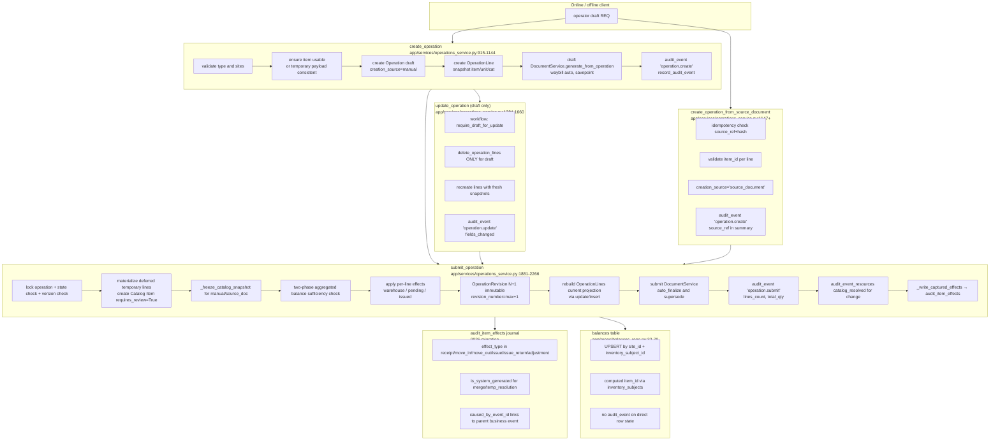
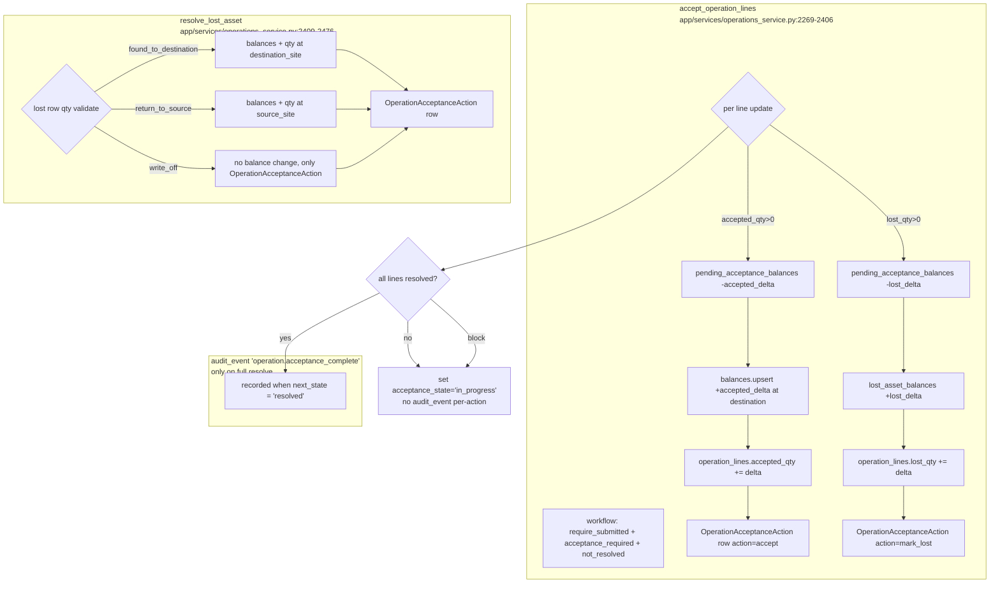
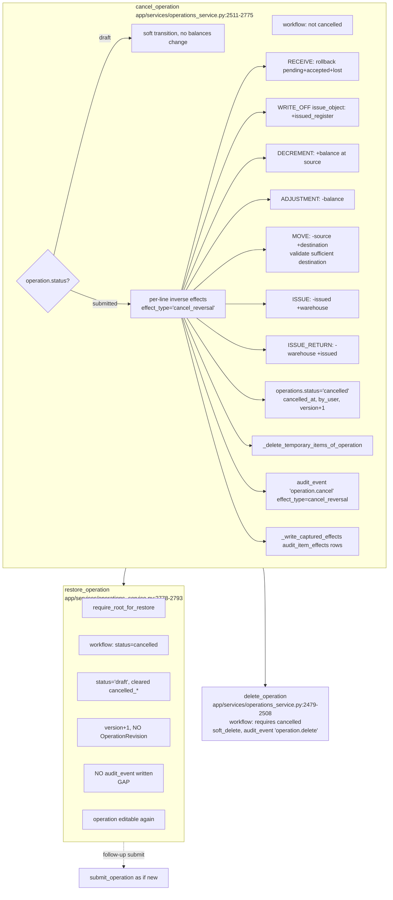
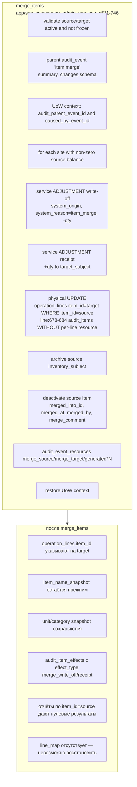
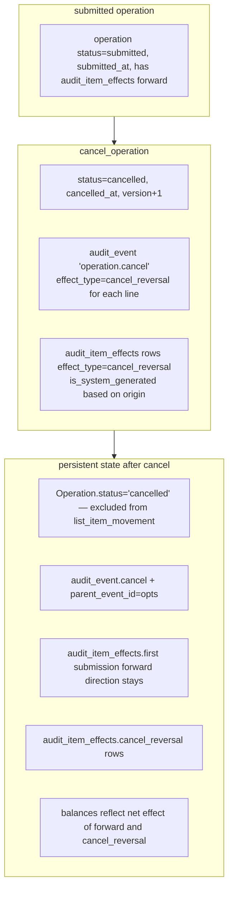
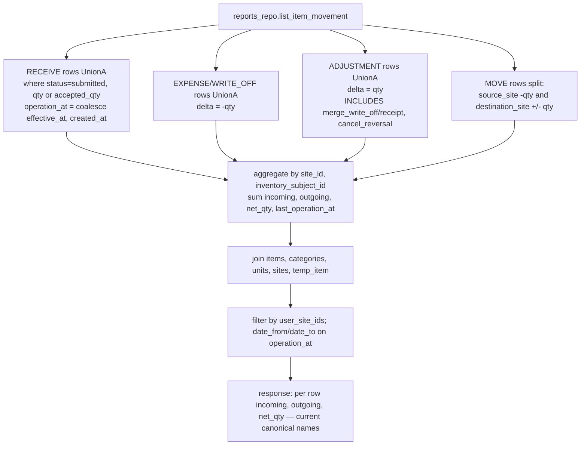
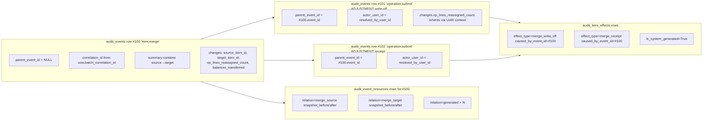
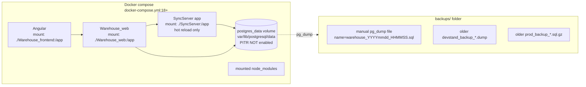

# Historical Data Flow — SyncServer

**Назначение:** визуальные карты write-path и audit chain для оценки
полноты воспроизводимости истории.

Все диаграммы ниже соответствуют реальному коду в `SyncServer/`.
Ссылки на конкретные файлы/строки приведены в `HISTORICAL_INTEGRITY_AUDIT.md`.

---

## 1. Полный жизненный цикл одной операции (draft → submit → effects → balances)



---

## 2. Acceptance / partial resolve / lost → финализация принятых строк



---

## 3. Cancel / Restore — мутации балансов и операций



---

## 4. Merge каталога — мутация OperationLine



---

## 5. Correction flow (V1, RECEIVE without acceptance_required)

```mermaid
flowchart TD
    subgraph Begin["begin_correction<br/>app/services/corrections_service.py:90-159"]
        CB1[operation.status='submitted' check]
        CB2[partial unique index: one active draft per op]
        CB3[clone baseline OperationRevision lines]
        CB4[create OperationCorrection status='draft']
    end

    subgraph Edit["update_correction_put/add/remove_line"]
        CE1[version optimistic check]
        CE2[no correction_kind from client allowed]
        CE3[replace_all_lines or insert single]
        CE4[audit_event 'operation.create' on draft creation]
    end

    subgraph SubmitCorr["submit_correction<br/>app/services/corrections_service.py:415-700"]
        CS1[lock correction; idempotency_key by (op, key)]
        CS2[lock operation; verify base_revision is current]
        CS3[_compute_diff: unchanged/metadata/quantity/item_replaced/added/removed]
        CS4[_validate_deltas against current balances]
        CS5[lock inventory_subjects ASC then balances]
        CS6[OperationRevision N+1 immutable]
        CS7[rebuild_operation_lines<br/>UPDATE by line_uuid, INSERT for added, DELETE for removed]
        CS8[operation.current_revision_id = N+1, correction_count++, last_corrected_at]
        CS9[DocumentService.generate_from_operation operation_revision_id=N+1]
        CS10[supersede old docs]
        CS11[audit_event 'operation.correction.applied'<br/>and document.revision_created, document.superseded]
        CS12[_write_captured_effects audit_item_effects rows]
    end

    subgraph Abandon["abandon_correction"]
        CA1[audit_event 'operation.correction.abandoned']
    end

    Begin --> Edit --> SubmitCorr
    SubmitCorr -.no changes.-> Begin
    Edit -.cancel by client.-> Abandon
```

---

## 6. Cancel reversal: что и где остаётся



---

## 7. Report flow — что считает `reports_repo.list_item_movement`



---

## 8. Audit chain: merge → system ADJUSTMENT → effects



---

## 9. Окружение данных вне PostgreSQL — где что лежит



---

## 10. Кто видит данные — RBAC

```mermaid
flowchart LR
    subgraph RBAC["SyncServer roles"]
        ROOT[root<br/>full bypass]
        CHIEF[chief_storekeeper<br/>all sites, can_view_cancelled, audit API]
        STORE[storekeeper<br/>only assigned sites<br/>no audit API]
        OBS[observer<br/>read-only on assigned sites]
    end

    ROOT --> AuditAll[GET /api/v1/audit<br/>GET /api/v1/audit/{event_id}<br/>Merge API /catalog/items merge<br/>Restore POST /operations/id/restore]
    CHIEF --> AuditAll
    STORE --> NoAudit[no access to audit history<br/>no restore<br/>no unmerge]
    OBS --> NoAudit

    CHIEF --> CancelSubmit[POST /operations/id/cancel<br/>after policy require_operation_cancel_permission]
    STORE --> CancelSubmit
    OBS --> ReadOnly
    ROOT --> Any[ANY endpoint]
```

---

## 11. Time-line одной операции в каноническом виде (как сейчас)

```mermaid
gantt
    title Что остаётся в БД для одной RECEIVE операции id=42
    dateFormat X
    axisFormat %s
    section Lifecycle
    01_create         :done, 0, 1
    02_update_x2      :done, 1, 3
    03_submit         :done, 3, 4
    04_merge_lines_rewrite :crit, 8, 9
    05_cancel_pending :done, 10, 11
    06_restore        :crit, 11, 12
    07_resubmit       :done, 12, 13
    section Persistent artefacts
    audit_event_create        :done, 0, 13
    audit_event_update_x2     :done, 1, 3
    audit_event_submit        :done, 3, 13
    audit_event_merge_parent  :crit, 8, 9
    audit_event_cancel        :done, 10, 11
    audit_item_effects rows   :done, 3, 13
    OperationRevision lines N+1:done, 3, 13
    OperationLines current    :done, 0, 13
    balances affected         :done, 3, 13
```



Эта диаграмма демонстрирует главный риск: шаги `04_merge_lines_rewrite`
и `06_restore` не имеют соответствующих `audit_event` строк (или
имеют частичное покрытие), но меняют канонические projections.

---

## 12. Сводная легенда потоков

| Класс узла | Цвет | Что означает |
|------------|------|--------------|
| Rectangle | blue | API endpoint / service method |
| Subgraph | gray | Транзакционная единица |
| Диск | yellow | Persistent table |
| Audit * | green | Audit_event / resource / effect |
| Толстая стрелка | black | Запись в БД |
| Пунктир | gray | Read-only или no-effect |
| `crit` | red | Многая найденных gaps |

Эти диаграммы соответствуют коду в
`SyncServer/app/services/operations_service.py`,
`SyncServer/app/services/catalog_admin_service.py`,
`SyncServer/app/services/corrections_service.py`,
`SyncServer/app/repos/{reports_repo,balances_repo,audit_events_repo,operations_repo}.py`,
`SyncServer/app/models/{operation,balance,audit_event,audit_item_effect,document}.py`,
`SyncServer/alembic/versions/0026_audit_item_effects.py`.

Полные риски по каждой связи — в `HISTORICAL_RISK_REGISTER.md`.
