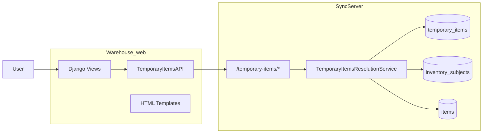
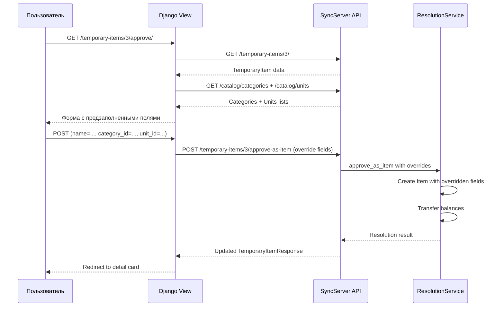

# План доработки карточки временной ТМЦ: merge + approve с выбором категории/единицы

## Проблема

Карточка временной ТМЦ по адресу `/temporary-items/{id}/` (Django-клиент) имеет следующие недостатки:

1. **Несоответствие статусов**: сервер возвращает `active`, `approved_as_item`, `merged_to_item`, `deleted`, а шаблоны используют `pending`, `approved`, `merged`, `rejected`.
2. **Несоответствие полей**: сервер возвращает `sku`, `created_by_user_id`, `unit_name`, `unit_symbol`, `category_name`, а шаблоны используют `code`, `user_id`, `site_id`.
3. **Нет отображения категории и единицы** на карточке.
4. **Нет информации о resolved_item** после approve/merge.
5. **Нет истории операций** по временной ТМЦ.
6. **Approve-as-item не позволяет изменять поля** (категорию, единицу, название) перед созданием постоянной ТМЦ.
7. **Merge не показывает resolved_item** и использует неверный метод загрузки каталога.

## Текущая архитектура



## Текущие endpoint'ы SyncServer (работают корректно)

| Method | Path | Description |
|--------|------|-------------|
| GET | `/temporary-items` | Список с фильтрацией |
| GET | `/temporary-items/{id}` | Детальная карточка |
| GET | `/temporary-items/{id}/operations` | Операции по временной ТМЦ |
| POST | `/temporary-items/{id}/approve-as-item` | ✅ Есть, но **не принимает кастомные поля** |
| POST | `/temporary-items/{id}/merge` | Слияние с существующей ТМЦ |
| DELETE | `/temporary-items/{id}` | Мягкое удаление |

## Проблема с approve-as-item

Текущий endpoint `POST /temporary-items/{id}/approve-as-item` **не принимает тело запроса** и создаёт постоянную ТМЦ, копируя все поля из временной как есть.

Это не позволяет пользователю:
- указать другую категорию
- изменить единицу измерения
- отредактировать название
- задать SKU
- написать описание

## Этапы доработки

---

### Этап 1: Исправить несоответствие полей и статусов в шаблонах Django

**Где**: `Warehouse_web/templates/temporary_items/*.html` (все 5 шаблонов)

**Что нужно сделать**:
1. Заменить все статусы:
   - `pending` → `active`
   - `approved` → `approved_as_item`
   - `merged` → `merged_to_item`
   - `rejected` → удалить (такого статуса нет)
   - Добавить `deleted`
2. Заменить поля:
   - `item.code` → `item.sku`
   - `item.user_id` → `item.created_by_user_id`
   - `item.site_id` — удалить (нет такого поля)
   - Добавить отображение `item.unit_name`, `item.unit_symbol`, `item.category_name`
   - Добавить отображение `item.resolved_item_id`, `item.resolution_type`, `item.resolution_note`
   - Добавить отображение `item.backing_item_is_active`
3. В списке (`list.html`): добавить колонки "Категория", "Единица"
4. В карточке (`detail.html`): отображать полную информацию

**Бюджет**: ~1-2 часа

**Файлы**:
- [`Warehouse_web/templates/temporary_items/list.html`](Warehouse_web/templates/temporary_items/list.html)
- [`Warehouse_web/templates/temporary_items/detail.html`](Warehouse_web/templates/temporary_items/detail.html)
- [`Warehouse_web/templates/temporary_items/approve.html`](Warehouse_web/templates/temporary_items/approve.html)
- [`Warehouse_web/templates/temporary_items/merge.html`](Warehouse_web/templates/temporary_items/merge.html)
- [`Warehouse_web/templates/temporary_items/confirm_delete.html`](Warehouse_web/templates/temporary_items/confirm_delete.html)

---

### Этап 2: Добавить на сервер возможность указать кастомные поля при approve-as-item

**Где**: [`SyncServer/app/api/routes_temporary_items.py`](SyncServer/app/api/routes_temporary_items.py), [`SyncServer/app/schemas/temporary_item.py`](SyncServer/app/schemas/temporary_item.py), [`SyncServer/app/services/temporary_items_resolution_service.py`](SyncServer/app/services/temporary_items_resolution_service.py)

**Новая схема запроса** — `TemporaryItemApproveRequest`:
```python
class TemporaryItemApproveRequest(BaseModel):
    name: str | None = None  # если не указано, берётся из временной
    sku: str | None = None
    unit_id: int | None = None
    category_id: int | None = None
    description: str | None = None
```

**Изменения в routes**:
```python
@router.post("/{temporary_item_id}/approve-as-item", response_model=TemporaryItemResponse)
async def approve_temporary_item(
    temporary_item_id: int,
    payload: TemporaryItemApproveRequest | None = None,  # NEW: optional body
    ...
)
```

**Изменения в ResolutionService.approve_as_item()**:
- Принимать опциональные override-поля
- Если override указан — использовать его вместо значения из временной ТМЦ
- Иначе — копировать как сейчас

**Логика**:
```python
new_item = Item(
    sku=payload.sku if payload.sku is not None else temp_item.sku,
    name=payload.name if payload.name is not None else temp_item.name,
    normalized_name=normalize(payload.name or temp_item.name),
    category_id=payload.category_id if payload.category_id is not None else temp_item.category_id,
    unit_id=payload.unit_id if payload.unit_id is not None else temp_item.unit_id,
    description=payload.description if payload.description is not None else temp_item.description,
    hashtags=temp_item.hashtags,
    is_active=True,
)
```

**Файлы**:
- [`SyncServer/app/schemas/temporary_item.py`](SyncServer/app/schemas/temporary_item.py) — добавить `TemporaryItemApproveRequest`
- [`SyncServer/app/api/routes_temporary_items.py`](SyncServer/app/api/routes_temporary_items.py) — добавить `payload` параметр
- [`SyncServer/app/services/temporary_items_resolution_service.py`](SyncServer/app/services/temporary_items_resolution_service.py) — модифицировать `approve_as_item()`

---

### Этап 3: Переработать страницу approve с формой выбора категории, единицы, названия

**Где**: [`Warehouse_web/apps/temporary_items/views.py`](Warehouse_web/apps/temporary_items/views.py), [`Warehouse_web/templates/temporary_items/approve.html`](Warehouse_web/templates/temporary_items/approve.html)

**Изменения в `TemporaryItemApproveView.get()`**:
- Загрузить список категорий и единиц через `CatalogAPI`
- Передать их в контекст шаблона

**Изменения в `TemporaryItemApproveView.post()`**:
- Собрать из POST-данных override-поля: `name`, `sku`, `unit_id`, `category_id`, `description`
- Отправить их в `TemporaryItemsAPI.approve_as_item()` (с новым payload)

**Изменения в шаблоне `approve.html`**:
- Вместо кнопки "Преобразовать" с confirm-диалогом — полноценная форма:
  - Название (текстовое поле, предзаполнено из временной ТМЦ)
  - SKU (текстовое поле)
  - Категория (select из списка категорий)
  - Единица измерения (select из списка единиц)
  - Описание (textarea)
- Кнопка "Создать постоянную ТМЦ"

**Изменения в `TemporaryItemsAPI.approve_as_item()`**:
- Добавить опциональный параметр `payload: dict | None = None`
- Если payload передан — отправлять его в POST body

---

### Этап 4: Исправить страницу merge

**Где**: [`Warehouse_web/apps/temporary_items/views.py`](Warehouse_web/apps/temporary_items/views.py), [`Warehouse_web/templates/temporary_items/merge.html`](Warehouse_web/templates/temporary_items/merge.html)

**Текущие проблемы**:
1. `TemporaryItemMergeView.get()` загружает каталог без поиска — может быть очень много
2. Нет отображения resolve-статуса на merge странице (хотя она только для `active`)
3. Нет поля `comment` (resolution_note), которое сервер принимает

**Что нужно сделать**:
1. Добавить поиск по каталогу на странице merge (или хотя бы пагинацию)
2. Добавить поле "Комментарий" к merge
3. После merge — показывать resolved_item_id и имя на карточке
4. В `merge.html` отображать корректные поля временной ТМЦ

---

### Этап 5: Добавить отображение истории операций на карточке

**Где**: [`Warehouse_web/apps/temporary_items/views.py`](Warehouse_web/apps/temporary_items/views.py), [`Warehouse_web/templates/temporary_items/detail.html`](Warehouse_web/templates/temporary_items/detail.html)

**В `TemporaryItemDetailView.get()`**:
- Загрузить операции через `TemporaryItemsAPI.list_temporary_item_operations()`
- Передать их в контекст

**В `detail.html`**:
- Добавить блок "Операции с этой ТМЦ"
- Таблица: ID операции, тип, дата, статус, количество, склад
- Ссылки на детальную страницу операции

---

### Этап 6: Обновить API-клиент (опционально)

**Где**: [`Warehouse_web/apps/sync_client/temporary_items_api.py`](Warehouse_web/apps/sync_client/temporary_items_api.py)

**Изменения**:
1. Исправить `approve_as_item()` — добавить опциональный `payload`
2. Добавить метод `list_categories()` и `list_units()` если их нет в CatalogAPI (или использовать существующие)

---

### Этап 7: Проверить и починить удаление

**Где**: [`Warehouse_web/apps/temporary_items/views.py`](Warehouse_web/apps/temporary_items/views.py), [`Warehouse_web/templates/temporary_items/confirm_delete.html`](Warehouse_web/templates/temporary_items/confirm_delete.html)

Проверить:
- Статусы в `confirm_delete.html`
- Обработку ошибок при удалении с ненулевыми остатками
- Редирект после успешного удаления

---

## Диаграмма потока approve-as-item (новая версия)



## Порядок выполнения

1. **Этап 1** — быстрые фиксы шаблонов (можно выполнить независимо)
2. **Этап 2** — серверная часть (нужна для Этапа 3)
3. **Этап 3** — новая форма approve (зависит от Этапа 2)
4. **Этап 4** — фикс merge
5. **Этап 5** — история операций
6. **Этап 6** — API-клиент (можно вместе с Этапом 2-3)
7. **Этап 7** — проверка удаления

## Риски

1. **Обратная совместимость**: добавление опционального body в `POST /approve-as-item` не ломает существующие вызовы, т.к. параметр опциональный.
2. **Загрузка каталога для merge**: при большом каталоге может быть медленно. Нужно хотя бы добавить поиск/пагинацию.
3. **Некорректные данные при approve**: если пользователь укажет несуществующую category_id или unit_id, сервер должен вернуть 422.
