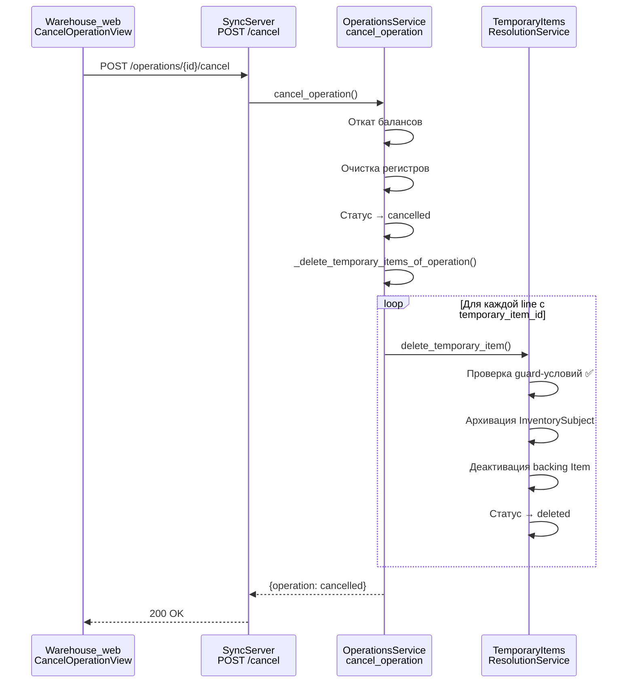
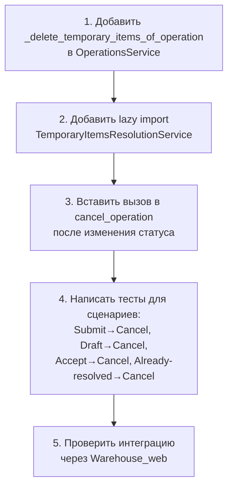

# План: Автоматическое удаление временных ТМЦ при отмене операции

## Контекст

При отмене операции (`POST /operations/{id}/cancel`) временные ТМЦ (Temporary Items), созданные в рамках этой операции, остаются в БД со статусом `active`. Это приводит к «засорению» списка временных ТМЦ и потенциальным проблемам с остатками.

## Текущее состояние

### SyncServer — [`cancel_operation`](SyncServer/app/services/operations_service.py:1038)

- Откатывает балансовые дельты (balance deltas)
- Очищает pending/lost/issued registers
- Устанавливает статус операции `cancelled`
- ❌ **НЕ удаляет временные ТМЦ**

### SyncServer — [`DELETE /temporary-items/{id}`](SyncServer/app/api/routes_temporary_items.py:145)

- Guard-условия: статус `active`, баланс == 0, нет активных регистров
- Мягкое удаление (status → `deleted`)
- Архивирует `InventorySubject`
- Деактивирует backing `Item`

### Warehouse_web — [`CancelOperationView`](Warehouse_web/apps/operations/views.py:649)

- Вызывает `OperationsAPI.cancel_operation(operation_id)`
- Редиректит на детали операции
- Ничего не знает о временных ТМЦ

### Связь Operation → TemporaryItem

```
Operation
  └── OperationLine (inventory_subject_id)
        └── InventorySubject (temporary_item_id)
              └── TemporaryItem
```

## Анализ guard-условий после `cancel_operation`

### Сценарий 1: Submit → Cancel (с приёмкой)

| Шаг | Pending | Balance | Lost | Status |
|-----|---------|---------|------|--------|
| Submit | +qty | 0 | 0 | submitted |
| Accept-line | -accepted_qty | +accepted_qty | +lost_qty | submitted |
| Cancel | -pending_qty | -accepted_qty | -lost_qty | cancelled |
| **Итого** | **0** | **0** | **0** | ✅ |

### Сценарий 2: Submit → Cancel (без приёмки)

| Шаг | Pending | Balance | Lost | Status |
|-----|---------|---------|------|--------|
| Submit | 0 | +qty | 0 | submitted |
| Cancel | 0 | -qty | 0 | cancelled |
| **Итого** | **0** | **0** | **0** | ✅ |

### Сценарий 3: Draft → Cancel (без submit)

| Шаг | Pending | Balance | Lost | Status |
|-----|---------|---------|------|--------|
| Create | 0 | 0 | 0 | draft |
| Cancel | 0 | 0 | 0 | cancelled |
| **Итого** | **0** | **0** | **0** | ✅ |

**Вывод:** После `cancel_operation` все guard-условия для удаления временных ТМЦ проходят.

## Анализ вариантов реализации

### Вариант A (⭐ Рекомендуемый): на SyncServer в `cancel_operation`

**Описание:** Добавить логику удаления временных ТМЦ в метод `OperationsService.cancel_operation`.

**Преимущества:**
- Единый источник истины — сервис, отменяющий операцию, сам чистит связанные ТМЦ
- Транзакционность — всё в одном UoW
- Guard-условия гарантированно проходят сразу после отката балансов
- Не требует дополнительных HTTP-вызовов
- Не требует изменений на Warehouse_web
- Временные ТМЦ удаляются атомарно вместе с отменой

**Недостатки:**
- Циркулярный импорт: `TemporaryItemsResolutionService` уже импортирует `OperationsService`
    - Решение: ленивый import внутри метода или вынос логики в отдельный helper

### Вариант B: на Warehouse_web в `CancelOperationView`

**Описание:** После вызова `cancel_operation` дополнительно дёргать `DELETE /temporary-items/{id}` для каждого временного ТМЦ.

**Недостатки:**
- ✗ Дополнительные HTTP-вызовы (N запросов на количество временных ТМЦ)
- ✗ Race condition: между cancel и delete кто-то может изменить состояние
- ✗ Сложность: нужно сначала получить список временных ТМЦ операции
- ✗ Нетранзакционно: cancel может пройти, а delete — упасть
- ✗ Усложнение web-слоя бизнес-логикой

### Вариант C: гибридный

Не имеет смысла — преимущества A очевидны.

## Рекомендованный подход: Вариант A

### Детальные изменения

#### 1. [`SyncServer/app/services/operations_service.py`](SyncServer/app/services/operations_service.py)

**Цель:** Добавить вызов `TemporaryItemsResolutionService.delete_temporary_item` для каждого активного временного ТМЦ, связанного с операцией.

**Изменения в методе `cancel_operation`:**

```python
@staticmethod
async def cancel_operation(
    uow: UnitOfWork,
    operation_id: UUID,
    user_id: UUID,
    reason: str | None = None,
) -> dict[str, object]:
    operation = await uow.operations.get_operation_by_id(operation_id)
    OperationsWorkflowPolicy.require_exists(operation)
    OperationsWorkflowPolicy.require_not_cancelled_for_cancel(operation)

    if operation.status == "submitted":
        for line in operation.lines:
            # ... существующая логика отката балансов и регистров ...
            pass

    cancelled_operation = await uow.operations.cancel_operation(
        operation_id=operation_id,
        cancelled_by_user_id=user_id,
    )

    # ===== НОВАЯ ЛОГИКА: удаление временных ТМЦ =====
    await OperationsService._delete_temporary_items_of_operation(
        uow, operation_id=operation_id, user_id=user_id,
    )
    # =================================================

    logger.info("cancelled operation=%s by user=%s reason=%s", operation_id, user_id, reason)
    return {"operation": cancelled_operation}
```

**Новый вспомогательный метод:**

```python
@staticmethod
async def _delete_temporary_items_of_operation(
    uow: UnitOfWork,
    operation_id: UUID,
    user_id: UUID,
) -> None:
    """Удалить временные ТМЦ, связанные с операцией.

    Проходит по всем линиям операции, находит InventorySubject
    с temporary_item_id и мягко удаляет активные временные ТМЦ.
    Уже разрешённые (approved/merged/deleted) ТМЦ пропускает.
    """
    from app.models.temporary_item import TemporaryItem

    operation = await uow.operations.get_operation_by_id(operation_id)
    if operation is None:
        return

    seen_temp_ids: set[int] = set()

    for line in operation.lines:
        if line.inventory_subject_id is None:
            continue  # не было inventory_subject (например, draft без submit)

        subject = await uow.inventory_subjects.get_by_id(line.inventory_subject_id)
        if subject is None or subject.temporary_item_id is None:
            continue  # не временный ТМЦ

        temp_id = subject.temporary_item_id
        if temp_id in seen_temp_ids:
            continue  # уже обработали
        seen_temp_ids.add(temp_id)

        temp_item = await uow.temporary_items.get_by_id(temp_id)
        if temp_item is None:
            continue
        if temp_item.status != TemporaryItem.STATUS_ACTIVE:
            continue  # уже разрешён — не трогаем

        # Используем существующий сервис с ленивым импортом
        from app.services.temporary_items_resolution_service import (
            TemporaryItemsResolutionService,
        )

        await TemporaryItemsResolutionService.delete_temporary_item(
            uow,
            temporary_item_id=temp_id,
            resolved_by_user_id=user_id,
            resolution_note=(
                f"Auto-deleted on cancel of operation {operation_id}"
            ),
        )
```

#### 2. [`SyncServer/app/services/temporary_items_resolution_service.py`](SyncServer/app/services/temporary_items_resolution_service.py)

**Изменения:** Не требуются. Метод `delete_temporary_item` используется как есть с его guard-условиями.

**Важно:** Guard-условия НЕ вызовут 409 после cancel, т.к.:
- `has_active_registers` — проверяет qty > 0. После cancel все регистры обнулены.
- `check_zero_balances` — проверяет qty != 0. После cancel все балансы обнулены.
- `status == active` — да, временная ТМЦ активна (ещё не разрешена).

#### 3. [`Warehouse_web/apps/operations/views.py`](SyncServer/../Warehouse_web/apps/operations/views.py) — [`CancelOperationView`](Warehouse_web/apps/operations/views.py:649)

**Изменения:** Не требуются. View остаётся без изменений — вся логика на SyncServer.

#### 4. [`Warehouse_web/apps/operations/views.py`](SyncServer/../Warehouse_web/apps/operations/views.py) — [`SubmitOperationView`](Warehouse_web/apps/operations/views.py:626)

**Изменения:** Не требуются.

### Схема вызовов



### Риски и альтернативы

| Риск | Вероятность | Влияние | Митигация |
|------|-------------|---------|-----------|
| Временная ТМЦ уже разрешена (approved/merged) | Низкая | Guard-условия вернут 409 | Проверяем статус перед вызовом; пропускаем не-active |
| Та же временная ТМЦ используется в другой операции | Низкая | Удаление сломает другую операцию | Каждая inline-ТМЦ уникальна для операции (новый `InventorySubject`) |
| Ошибка при удалении одной ТМЦ из многих | Средняя | Транзакция откатится полностью | Это правильно — консистентность важнее частичного успеха |
| Циркулярный импорт | Средняя | ImportError | Ленивый import внутри метода |
| Отмена операции с большим кол-вом временных ТМЦ | Низкая | Медленная отмена | N+1 запросов; можно оптимизировать batch-загрузкой |

### Когда НЕ удалять временные ТМЦ

Сценарии, где автоудаление НЕ сработает (корректно):

1. **Временная ТМЦ уже approved_as_item** — статус `approved_as_item`, guard пропускает
2. **Временная ТМЦ уже merged_to_item** — статус `merged_to_item`, guard пропускает
3. **Временная ТМЦ уже deleted** — статус `deleted`, guard пропускает

Во всех этих случаях временная ТМЦ уже разрешена и не должна удаляться при отмене операции.

### План имплементации



## Заключение

Рекомендуется реализация **Варианта A** — добавление логики удаления временных ТМЦ в `OperationsService.cancel_operation` на SyncServer. Это минимальное, транзакционное и консистентное решение, не требующее изменений в Warehouse_web.
