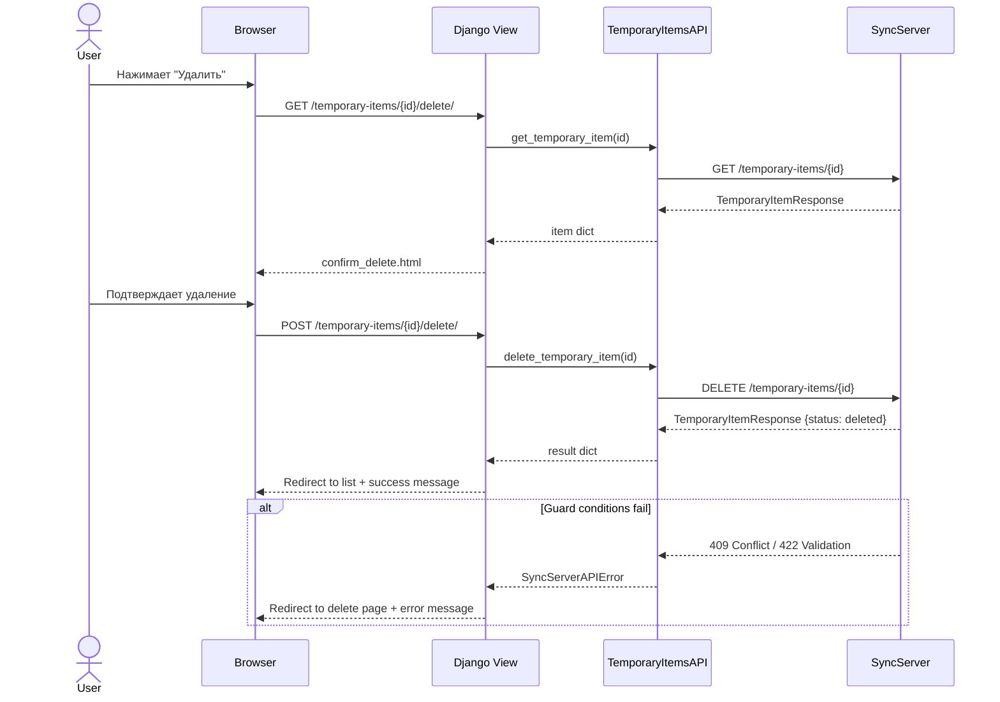

# План реализации удаления временных ТМЦ в Django (Warehouse_web)

## Контекст

На SyncServer уже реализован `DELETE /temporary-items/{id}` endpoint с мягким удалением:
- `STATUS_DELETED = "deleted"` в модели
- `mark_deleted` в репозитории
- `delete_temporary_item` в сервисе с guard-проверками (активный статус, нулевой баланс, нет активных регистров)
- Интеграционные тесты

Необходимо реализовать frontend (Django) часть — view, URL, шаблон, клиент API.

---

## 1. Метод API-клиента — [`TemporaryItemsAPI.delete_temporary_item`](Warehouse_web/apps/sync_client/temporary_items_api.py)

Добавить метод по аналогии с [`CatalogAPI.delete_item`](Warehouse_web/apps/sync_client/catalog_api.py:571):

```python
def delete_temporary_item(
    self,
    temporary_item_id: str | int,
    *,
    acting_user_id: str | int | None = None,
    acting_site_id: str | int | None = None,
) -> dict[str, Any]:
    """
    Soft-delete a temporary item.

    Endpoint: DELETE /temporary-items/{temporary_item_id}

    Returns: TemporaryItemResponse with status='deleted'
    """
    logger.info("Deleting temporary item", extra={"temporary_item_id": temporary_item_id})
    return self.client.delete(
        f"/temporary-items/{temporary_item_id}",
        acting_user_id=acting_user_id,
        acting_site_id=acting_site_id,
    )
```

**Почему**: Все существующие методы в `TemporaryItemsAPI` следуют этому паттерну и используют `self.client` напрямую.

---

## 2. View — [`TemporaryItemDeleteView`](Warehouse_web/apps/temporary_items/views.py)

По аналогии с [`CategoryDeleteView`](Warehouse_web/apps/catalog/views.py:528):

```python
class TemporaryItemDeleteView(SyncContextMixin, View):
    """Подтверждение и мягкое удаление временной ТМЦ."""

    template_name = "temporary_items/confirm_delete.html"

    def get(self, request, item_id, *args, **kwargs):
        if not can_manage_catalog(request.user):
            messages.error(request, "У вас нет прав для управления каталогом.")
            return redirect("client:dashboard")

        try:
            temp_api = TemporaryItemsAPI(self.client)
            item = temp_api.get_temporary_item(item_id)
        except SyncServerAPIError as e:
            if e.status_code == 404:
                raise Http404("Временная ТМЦ не найдена.")
            logger.error("Ошибка при получении временной ТМЦ %s: %s", item_id, e)
            messages.error(request, "Не удалось загрузить данные временной ТМЦ.")
            return redirect("temporary_items:list")

        context = {"item": item, "back_url": reverse("temporary_items:detail", kwargs={"item_id": item_id})}
        return render(request, self.template_name, context)

    def post(self, request, item_id, *args, **kwargs):
        if not can_manage_catalog(request.user):
            messages.error(request, "У вас нет прав для управления каталогом.")
            return redirect("client:dashboard")

        try:
            temp_api = TemporaryItemsAPI(self.client)
            result = temp_api.delete_temporary_item(item_id)
            messages.success(request, "Временная ТМЦ удалена.")
            return redirect("temporary_items:list")
        except SyncServerAPIError as e:
            if e.status_code == 404:
                raise Http404("Временная ТМЦ не найдена.")
            logger.error("Ошибка при удалении временной ТМЦ %s: %s", item_id, e)
            # Извлекаем детальную ошибку из ответа SyncServer
            error_detail = str(e)
            try:
                error_data = json.loads(str(e))
                error_detail = error_data.get("detail", str(e))
            except (json.JSONDecodeError, TypeError):
                pass
            messages.error(request, f"Не удалось удалить временную ТМЦ: {error_detail}")
            return redirect("temporary_items:delete", item_id=item_id)
```

**Почему**:
- GET — отображает страницу подтверждения с деталями ТМЦ (как `CategoryDeleteView`)
- POST — выполняет удаление через API (как `ItemDeactivateView`)
- guard-ошибки от SyncServer (баланс не ноль, активные регистры) показываются пользователю

---

## 3. URL — [`temporary_items/urls.py`](Warehouse_web/apps/temporary_items/urls.py)

```python
from .views import (
    TemporaryItemApproveView,
    TemporaryItemDeleteView,    # новый импорт
    TemporaryItemDetailView,
    TemporaryItemListView,
    TemporaryItemMergeView,
)

urlpatterns = [
    path("", TemporaryItemListView.as_view(), name="list"),
    path("<str:item_id>/", TemporaryItemDetailView.as_view(), name="detail"),
    path("<str:item_id>/approve/", TemporaryItemApproveView.as_view(), name="approve"),
    path("<str:item_id>/merge/", TemporaryItemMergeView.as_view(), name="merge"),
    path("<str:item_id>/delete/", TemporaryItemDeleteView.as_view(), name="delete"),  # новый путь
]
```

**Почему**: Именование `delete` соответствует паттерну `nomenclature:item_delete` и `nomenclature:category_delete`.

---

## 4. Шаблон — [`temporary_items/confirm_delete.html`](Warehouse_web/templates/temporary_items/confirm_delete.html)

По аналогии с [`catalog/category_confirm_delete.html`] (не читали, но паттерн очевиден):

```html

Удаление временной ТМЦ

<div class="operation-page-header">
  <div>
    <h1>Удаление временной ТМЦ</h1>
    <p class="operation-page-note">
      Вы уверены, что хотите удалить временную ТМЦ? Это действие
      невозможно отменить.
    </p>
  </div>
</div>

<div class="card">
  <h3>Информация о временной ТМЦ</h3>
  <table class="data-table">
    <tbody>
      <tr>
        <th>ID</th>
        <td><code>{{ item.id }}</code></td>
      </tr>
      <tr>
        <th>Название</th>
        <td>{{ item.name|default:"—" }}</td>
      </tr>
      <tr>
        <th>Код</th>
        <td>{{ item.code|default:"—" }}</td>
      </tr>
      <tr>
        <th>Статус</th>
        <td>
          
          <span class="badge badge-warning">Ожидает</span>
          
          <span class="badge badge-success">Преобразована</span>
          
          <span class="badge badge-info">Объединена</span>
          
          <span class="badge badge-danger">Отклонена</span>
          
          <span class="badge">{{ item.status }}</span>
          
        </td>
      </tr>
    </tbody>
  </table>
</div>

<div class="card">
  <h3>Подтверждение</h3>
  <p>Удаление возможно только если:</p>
  <ul>
    <li>Временная ТМЦ имеет статус "Ожидает" (не преобразована и не объединена)</li>
    <li>Остаток по временной ТМЦ равен нулю</li>
    <li>Нет активных операций, ссылающихся на эту ТМЦ</li>
  </ul>
  <form method="post" style="display: inline">
    
    <button type="submit" class="btn btn-danger">Удалить</button>
    <a href="{{ back_url }}" class="btn btn-secondary">Отмена</a>
  </form>
</div>

```

---

## 5. Обновление [`temporary_items/detail.html`](Warehouse_web/templates/temporary_items/detail.html)

Добавить кнопку удаления в блок действий (внутри ``):

```html
<a href="" class="btn btn-danger">Удалить</a>
```

---

## 6. Обновление [`temporary_items/list.html`](Warehouse_web/templates/temporary_items/list.html)

Добавить кнопку удаления в колонку "Действия" (внутри ``):

```html
<a href="" class="btn btn-sm btn-danger">Удалить</a>
```

---

## Схема вызовов



---

## Проверка ограничений SyncServer

Сервер проверяет перед удалением:
1. Статус должен быть `active` (не `approved`/`merged`/`rejected`/`deleted`)
2. `current_balance == 0`
3. Нет активных записей в `pending_register`, `lost_register`, `issued_register`

Если какое-то условие не выполнено, SyncServer вернёт ошибку с description. View должна показать эту ошибку пользователю.
